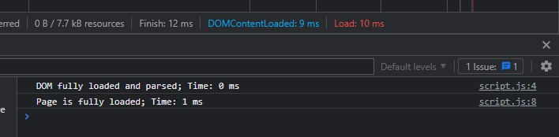

# Лабораторная работа №5

## Задание 1

Время, требуемое на загрузку документа и его отображение, можно вывести в консоль браузера с помощью следующего скрипта:

```JS
const start = Date.now()

window.addEventListener('DOMContentLoaded', () => {
  console.log(`DOM fully loaded and parsed; Time: ${Date.now() - start} ms`)
})

window.addEventListener('load', () => {
  console.log(`Page is fully loaded; Time: ${Date.now() - start} ms`)
})
```

Однако оно не совпадает с тем, что выводит консоль разработчика:

